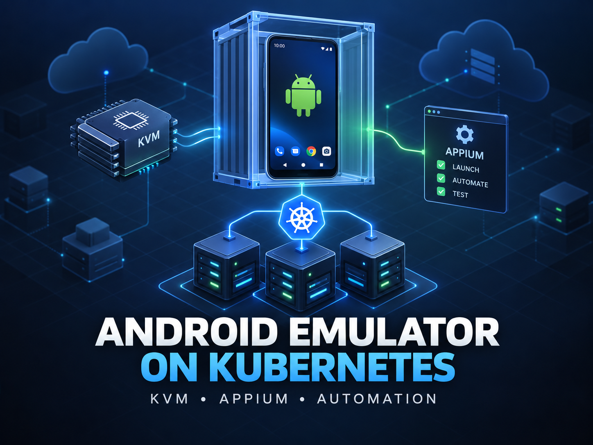
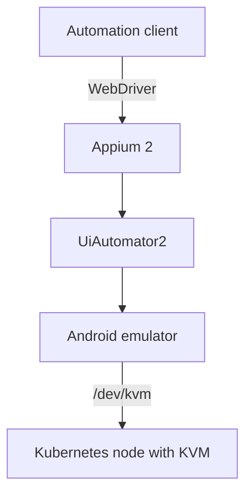

# Android Emulator on Kubernetes



A reproducible, headless Android emulator environment running in Kubernetes with KVM acceleration, Appium 2 and UiAutomator2.

> This repository is an independent reference implementation built with public components. It contains no employer source code, application packages, credentials, internal endpoints or production configuration.

## Why

Mobile automation often depends on Android Studio and an emulator running on a developer workstation. That makes long-running jobs fragile, hard to reproduce and tied to one person's computer. This project moves the emulator into Kubernetes so automation clients can use a persistent Appium endpoint.

## Architecture



## Prerequisites

- A Linux Kubernetes node with KVM available as `/dev/kvm`
- Nested virtualization enabled when the node itself is a virtual machine
- Permission to run this dedicated workload as a privileged container
- `kubectl`, Docker and Kustomize support in `kubectl`

Do not deploy this manifest into a shared or untrusted cluster without applying your organization's security controls. Access to `/dev/kvm` and privileged containers should be tightly restricted.

## Quick start

Check KVM on the target node:

```bash
./scripts/check-kvm.sh
kubectl label node <node-name> emulator.k8s.io/kvm=true
```

Build and publish the image:

```bash
docker build -t ghcr.io/holydanchik/android-emulator-on-kubernetes:latest .
docker push ghcr.io/holydanchik/android-emulator-on-kubernetes:latest
```

Deploy it:

```bash
kubectl apply -k kubernetes
kubectl -n android-emulator rollout status deployment/android-emulator --timeout=10m
kubectl -n android-emulator port-forward service/android-emulator 4723:4723
```

In another terminal, test Appium:

```bash
python3 -m venv .venv
source .venv/bin/activate
pip install -r examples/requirements.txt
python examples/smoke_test.py
```

## Configuration

The reference manifest uses one replica and the `Recreate` strategy because an emulator is stateful and consumes a hardware virtualization device. Customize the image reference, CPU/memory values and device profile in `kubernetes/deployment.yaml`.

Applications are deliberately excluded. Mount or download APKs at runtime using your own authorized artifact source; never commit proprietary APKs or credentials.

## Troubleshooting

### Pod stays Pending

Confirm that a node has the required label:

```bash
kubectl get nodes -l emulator.k8s.io/kvm=true
```

### Emulator is slow or fails to boot

Verify `/dev/kvm` exists on the selected node and nested virtualization is enabled. Software emulation is substantially slower and is not the target of this example.

### Appium is not ready

Inspect startup logs and both supported health endpoints:

```bash
kubectl -n android-emulator logs deployment/android-emulator
curl http://127.0.0.1:4723/status
curl http://127.0.0.1:4723/wd/hub/status
```

Initial emulator boot can take several minutes. The readiness probe allows up to roughly four minutes after its initial delay.

## Scope and limitations

- One emulator per pod is the intended model.
- Hardware, kernel modules and cluster runtime must support KVM passthrough.
- The public base image and dependencies should be reviewed and pinned to digests before production use.
- This example does not expose Appium outside the cluster and does not include an APK.

## License

MIT
